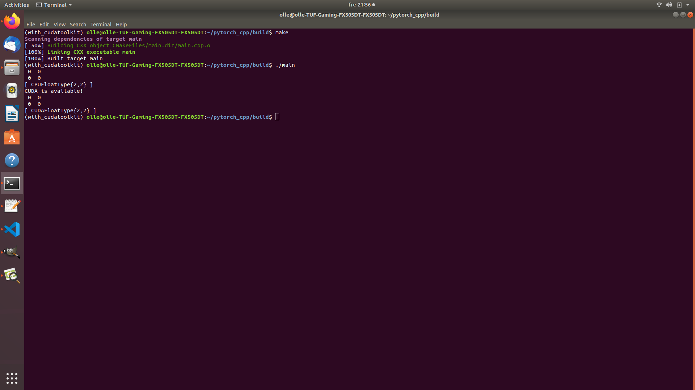

# Installing and Test PyTorch C++ API on Ubuntu with GPU enabled

## Install PyTorch with Anaconda for python:

Youtube:

https://www.youtube.com/watch?v=GYbNqcS-o1w

### 1. Install NVIDIA dirver

Check NVIDIA driver is installed
	
	$ nvidia-smi
	+-----------------------------------------------------------------------------+
	| NVIDIA-SMI 440.33.01    Driver Version: 440.33.01    CUDA Version: 10.2     |
	|-------------------------------+----------------------+----------------------+
	| GPU  Name        Persistence-M| Bus-Id        Disp.A | Volatile Uncorr. ECC |
	| Fan  Temp  Perf  Pwr:Usage/Cap|         Memory-Usage | GPU-Util  Compute M. |
	|===============================+======================+======================|
	|   0  GeForce GTX 1650    On   | 00000000:01:00.0 Off |                  N/A |
	| N/A   37C    P8     3W /  N/A |      0MiB /  3911MiB |      0%      Default |
	+-------------------------------+----------------------+----------------------+
                                                                               
	+-----------------------------------------------------------------------------+
	| Processes:                                                       GPU Memory |
	|  GPU       PID   Type   Process name                             Usage      |
	|=============================================================================|
	|  No running processes found                                                 |
	+-----------------------------------------------------------------------------+

### 2. 	Make sure you have installed Anaconda viritual enviroment for PyTorch 

https://problemsolvingwithpython.com/01-Orientation/01.05-Installing-Anaconda-on-Linux/

Download 
64-Bit (x86) Installer (522 MB)
	
https://www.anaconda.com/products/individual

### 3.	After installed Anaconda start a new Terminal
	
	(base) user@computer:~$ conda install pytorch torchvision cudatoolkit=10.2 -c pytorch
	(base) user@computer:~$ conda list pytorch
	(base) user@computer:~$ sudo snap install --classic code

#### 3.	Update 2023-12-28

	(base) user@computer:~$ conda install -c pytorch torchvision
	(base) user@computer:~$ conda install -c anaconda cudatoolkit
	(base) user@computer:~$ conda list pytorch
	(base) user@computer:~$ sudo snap install --classic code
 

### 4. 	Check Anaconda installation With PyTorch for Python wilt Cudatoolkit

	(base) user@computer:~$ python
	Python 3.7.6 (default, Jan  8 2020, 19:59:22) 
	[GCC 7.3.0] :: Anaconda, Inc. on linux
	Type "help", "copyright", "credits" or "license" for more information.
	>>> import torch
	>>> print(torch.version.cuda)
	10.2
	>>> print(torch.__version__)
	1.5.0
	>>> import numpy as np
  	>>> print(np.__version__)
  	1.18.1
  	>>> exit()
  	(base) user@computer:~$

### 5.	Create a new viritual enviroment cloned from (base) 

	(base) user@computer:~$ conda create --name with_cudatoolkit --clone base

### 6.	Activate the new cloned conda enviroment

	(base) user@computer:~$ conda activate with_cudatoolkit
  

## Prepare for C++ with CUDA and cuDNN in Anaconda virituell enviroment:

### 7.	Install anaconda cudatoolkit

anaconda / packages / cudatoolkit 10.2.89
	
https://anaconda.org/anaconda/cudatoolkit

	(with_cudatoolkit) user@computer:~$ conda install -c anaconda cudatoolkit
  

### 8.	Install anaconda cudatoolkit-dev

conda-forge / packages / cudatoolkit-dev 10.1.243
	
https://anaconda.org/conda-forge/cudatoolkit-dev

	(with_cudatoolkit) user@computer:~$ conda install -c conda-forge cudatoolkit-dev
  

### 9. 	Now you can check that CUDA compiler is installed

	(with_cudatoolkit) user@computer:~$ nvcc --version
	nvcc: NVIDIA (R) Cuda compiler driver
	Copyright (c) 2005-2019 NVIDIA Corporation
	Built on Sun_Jul_28_19:07:16_PDT_2019
	Cuda compilation tools, release 10.1, V10.1.243
	(with_cudatoolkit) user@computer:~$

### 10. 	Install anaconda cuDNN

anaconda / packages / cudnn 7.6.5
	
https://anaconda.org/anaconda/cudnn

	(with_cudatoolkit) user@computer:~$ conda install -c anaconda cudnn

## Testing PyTorch C++ API with GPU and conda enviroment:

### 11. 	Check the homepage PyTorch

Using the PyTorch C++ Frontend

https://pytorch.org/tutorials/advanced/cpp_frontend.html

### 12. 	Download PyTorch C++ API 

Getting stated

https://pytorch.org/get-started/locally/

I choose:

	PyTorch Build:		Stable(1.6.0)
	Your OS:		Linux
	Package:		LibTorch
	Language:		C++/Java
	CUDA:			10.2

	Run this Command:	Download here (Pre-cxx11 ABI):

https://download.pytorch.org/libtorch/cu102/libtorch-shared-with-deps-1.6.0.zip

#### Command line download option use wget

	$ wget https://download.pytorch.org/libtorch/cu102/libtorch-shared-with-deps-1.6.0.zip
				

### 13. 	Make some directories

	(with_cudatoolkit) user@computer:~$ mkdir pytorch_cpp
	(with_cudatoolkit) user@computer:~$ cd pytorch_cpp
	(with_cudatoolkit) user@computer:~/pytorch_cpp/$ mkdir build
	(with_cudatoolkit) user@computer:~/pytorch_cpp/$ cd build
	(with_cudatoolkit) user@computer:~/pytorch_cpp/build/$
	

### 14.	unzip the file 

libtorch-shared-with-deps-1.6.0.zip
	
in 
	
	(with_cudatoolkit) user@computer:~/pytorch_cpp/$
	
folder.

### 15.	Make sure you have installed cmake

### 16.	Copy my files from GitHub

	CMakeLists.txt
	main.cpp

Put them in folder
	
	(with_cudatoolkit) user@computer:~/pytorch_cpp/

Or make test files from text 
	https://pytorch.org/tutorials/advanced/cpp_frontend.html

### 17.	Do the cmake command with respect to absolute path to the PyTorch C++ API

`(with_cudatoolkit) olle@computer:~/pytorch_cpp/build$ cmake -DCMAKE_PREFIX_PATH=/home/olle/pytorch_cpp/libtorch-shared-with-deps-1.6.0/libtorch ..`

	-- The C compiler identification is GNU 7.5.0
	-- The CXX compiler identification is GNU 7.5.0
	-- Check for working C compiler: /usr/bin/cc
	-- Check for working C compiler: /usr/bin/cc -- works
	-- Detecting C compiler ABI info
	-- Detecting C compiler ABI info - done
	-- Detecting C compile features
	-- Detecting C compile features - done
	-- Check for working CXX compiler: /usr/bin/c++
	-- Check for working CXX compiler: /usr/bin/c++ -- works
	-- Detecting CXX compiler ABI info
	-- Detecting CXX compiler ABI info - done
	-- Detecting CXX compile features
	-- Detecting CXX compile features - done
	-- Looking for pthread.h
	-- Looking for pthread.h - found
	-- Looking for pthread_create
	-- Looking for pthread_create - not found
	-- Looking for pthread_create in pthreads
	-- Looking for pthread_create in pthreads - not found
	-- Looking for pthread_create in pthread
	-- Looking for pthread_create in pthread - found
	-- Found Threads: TRUE  
	-- Found CUDA: /home/olle/anaconda3/envs/with_cudatoolkit (found version "10.1") 
	-- Caffe2: CUDA detected: 10.1
	-- Caffe2: CUDA nvcc is: /home/olle/anaconda3/envs/with_cudatoolkit/bin/nvcc
	-- Caffe2: CUDA toolkit directory: /home/olle/anaconda3/envs/with_cudatoolkit
	-- Caffe2: Header version is: 10.1
	-- Found CUDNN: /home/olle/anaconda3/envs/with_cudatoolkit/lib/libcudnn.so  
	-- Found cuDNN: v7.6.5  (include: /home/olle/anaconda3/envs/with_cudatoolkit/include, library: /home/olle/anaconda3/envs/with_cudatoolkit/lib/libcudnn.so)
	-- Autodetected CUDA architecture(s):  7.5
	-- Added CUDA NVCC flags for: -gencode;arch=compute_75,code=sm_75
	-- Found Torch: /home/olle/pytorch_cpp/libtorch-shared-with-deps-1.6.0/libtorch/lib/libtorch.so
	-- Configuring done
	-- Generating done
	-- Build files have been written to: /home/olle/pytorch_cpp/build
	(with_cudatoolkit) olle@computer:~/pytorch_cpp/build$

### 18.	Do the make command

	(with_cudatoolkit) olle@computer:~/pytorch_cpp/build$ make
	Scanning dependencies of target main
  	[ 50%] Building CXX object CMakeFiles/main.dir/main.cpp.o
  	[100%] Linking CXX executable main
  	[100%] Built target main
  	(with_cudatoolkit) olle@computer:~/pytorch_cpp/build$

### 19.	Run the code
	
	(with_cudatoolkit) olle@computer:~/pytorch_cpp/build$ ./main
	 0  0
	 0  0
	[ CPUFloatType{2,2} ]
	CUDA is available! 
	 0  0
	 0  0
	[ CUDAFloatType{2,2} ]
	(with_cudatoolkit) olle@computer:~/pytorch_cpp/build$

